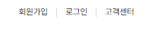
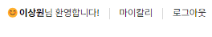

# React-Homework

## 1. 바닐라 프로젝트때의 일부분을 리액트 컴포넌트로 구성해보기
> [페이지 링크 이동](https://react-sang01.netlify.app/)


### 1. 과제 주제
> 바닐라 프로젝트때 담당했던 파트중 하나인 헤더를 리액트 컴포넌트로 구성해보고자 했다.

### 2. 코드 작성 과정

1) 과제 스케폴딩
---
- `pnpm` 사용
- 수업에서 배운 `jsx`의 컴파일 방식 중 프로젝트 때 사용해 익숙한 `vite`를 사용하기로 결정
- `netlify`를 이용해 배포

2) 헤더 root의 구역 할당
---
- 상단: 로그인 상태 표시
- 하단: 로고 및 검색버튼 / 기능버튼
```js
const headerWrapper = (
  <div className="header_wrapper">
    {signMenu} {/* 로그인 상태 표시 */}
    {visual} {/* 로고 및 검색버튼 / 기능버튼 */}
  </div>
)
```

3) 로그인 상태 표시 코드 작성
---
- 로그인 상태(`isAuth`)에 따라 `signMenu` 컴포넌트를 다르게 전달해주도록 구성했다.

  <table>
    <tr>
      <td rowspan="4">
        signMenu<br />

  
      </td>
      <th>isAuth=true</th>
    </tr>
    <td>
      
  
    </td>
    <tr>
      <th>isAuth=false</th>
    </tr>
      <td>
        
  
    </td>  
  
  </table>  


4) visual의 구역 할당
---
- 로고영역, 검색영역, 링크영역 3단계로 분할했다.
- visualTitle : 로고 및 탭 이동 영역
- searchBox : 검색 영역
- menuLink : 주요 링크 모음 영역
```js
const visual = (
  <div className="visual">
    {visualTitle}
    {searchBox}
    {menuLink}
  </div>
)
```

### 3. 마치며
---
> 리액트로 처음 컴포넌트식 구성을 통한 마크업 개발을 해본 기념비적인 과제라고 생각한다. <br />
> 처음엔 어떻게 컴포넌트들을 구성해서 조립할지 감이 잘 오지 않았는데, 기존에 개발했던 페이지 구조를 토대로 <br />
> 각 부분들을 컴포넌트화 - `나는 변수 등록 정도로 이해했다.` 해서 끼워맞추기식으로 확장시켜 나가는 그림을 그려나갔던것 같다.<br />
> 로그인 표시 상태줄에서 이벤트를 통해 간단히 로그인/로그아웃 이벤트도 구현하려고 했는데.. <br />
> 조건이나 promise를 통한 이벤트리스너 등록이 안돼서 적용해보진 못했다. <br />
> 아마 리액트에서도 따로 이벤트를 등록하는 방법이 있을 것 같은데, 빨리 배우고 싶은 생각이 들었다.
