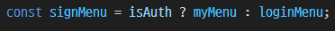

# React-Homework

## 1. 바닐라 프로젝트때의 일부분을 리액트 컴포넌트로 구성해보기
> [페이지 링크 이동](https://react-sang01.netlify.app/)


### 1. 과제 주제
> 바닐라 프로젝트때 담당했던 파트중 하나인 헤더를 리액트 컴포넌트로 구성해보고자 했다.

### 2. 코드 작성 과정

1) 과제 스케폴딩<br />
- `pnpm` 사용
- 수업에서 배운 `jsx`의 컴파일 방식 중 프로젝트 때 사용해 익숙한 `vite`를 사용하기로 결정
- `netlify`를 이용해 배포

2) 헤더 root의 구역 할당
- 상단: 로그인 상태 표시
- 하단: 로고 및 검색버튼 / 기능버튼
```js
const headerWrapper = (
  <div className="header_wrapper">
    {signMenu} {/* 로그인 상태 표시 */}
    {visual} {/* 로고 및 검색버튼 / 기능버튼 */}
  </div>
)
```

3) 로그인 상태 표시 코드 작성
- 로그인 상태(`isAuth`)에 따라 `signMenu` 컴포넌트를 다르게 전달해주도록 구성했다.<br />

  <table>
  <tr>
    <td rowspan="4">
      signMenu<br />
      
    </td>
    <th>isAuth=true</th>
  </tr>
  <tr>
    <td></td>
  </tr>
  <tr>
    <th>isAuth=false</th>
  </tr>
  <tr>
    <td></td>
  </tr>
  
  </table>